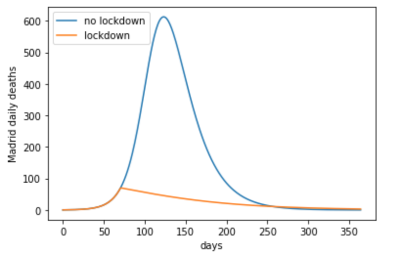
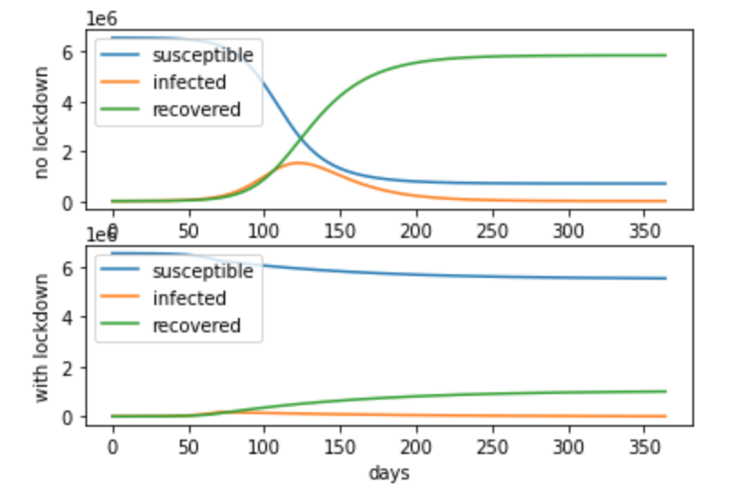

# Overview

This contains a layman's attempts at understanding covid-19 using quantitative measures.

[The jupyter notebook](sir.ipynb) contains the actual work.

* [Goals](#goals)
* [Usage](#usage)

## Goals

* create a disease dynamics model to simulate disease progression, based on the [SIR model](https://en.wikipedia.org/wiki/Compartmental_models_in_epidemiology)
* estimate the model parameters from daily death data for covid-19: this means building a [bayesian hierarchical model](https://en.wikipedia.org/wiki/Bayesian_hierarchical_modeling) using the disease dynamics and using methods like [markov chain monte carlo](https://en.wikipedia.org/wiki/Markov_chain_Monte_Carlo) for inference.

A few months ago when I was growing confused at the news about covid-19: I decided to get some clarity by learning some basic epidemiology:
* I wrote a trivial numerical integrator for the SIR model
* plugged in R0 and mortality estimates (and their error bars) appearing in peer-reviewed publications
* plugged in the numbers for Madrid
* compared a scenario with lockdown to a no-lockdown scenario

and came up with something like this, most scenarios for the plausible R0s and fatality rates were pretty scary:

Now I'm locked down and have time to burn I'll build a Bayesian model for this, which is something I enjoy but rarely get to do.

## Usage

You'll need make and a reasonably modern version of python 3.

* `make env_ok` sets up the virtual env
* `make test` runs typecheckers, linters and unit tests
* `make fmt` runs code formatters

To run the jupyter notebook in the correct context, simply `make run_notebook`.
